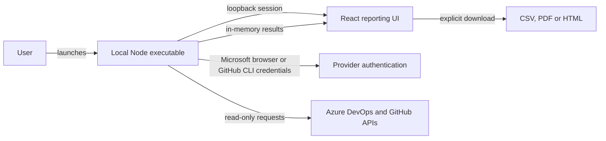

# Committer Insights

Explore Azure DevOps and GitHub repository usage, security enablement, and purchasing evidence on your own computer. The executable opens a local reporting workspace with graphs, time filters, repository detail, security estimates, and optional GitHub billing usage. Export CSV, PDF, or standalone HTML without uploading report data to a hosted service.

> **Independent community project.** This repository is not a Microsoft or
> GitHub product, assessment, endorsement, support offering, or official
> licensing source. Some contributors may be Microsoft employees acting in an
> individual or community capacity. Validate estimates, permissions, licensing
> implications, and generated reports against official sources before using them
> for business decisions. See [DISCLAIMER.md](DISCLAIMER.md).

## Contents

- [Get started](#get-started)
- [Privacy and security](#privacy-and-security)
- [Threat model](#threat-model)
- [Microsoft Entra setup](#microsoft-entra-setup)
- [Build from source](#build-from-source)
- [Development](#development)
- [Validation](#validation)
- [Release boundary](#release-boundary)
- [Release notes](#release-notes)
- [Troubleshooting](#troubleshooting)
- [License](#license)

## Why local

- Azure and GitHub tokens and report data stay on the user's computer.
- No hosted API, database, Azure subscription, PAT, or customer secret is required.
- Microsoft sign-in uses the system browser with a publisher-configured public-client identity; no Azure CLI login is required.
- Closing the executable clears its in-memory session and reports.

## Get started

1. Download the Windows executable and `SHA256SUMS.txt` from the release.
2. Verify the checksum and review its signing status. Unsigned beta artifacts are for evaluation only; a checksum does not verify the publisher. Production distribution requires a verified publisher signature.
3. For Azure DevOps, select **Sign in with Microsoft** and choose your account on Microsoft's page. The app connects directly and shows the signed-in username with **Change account**. Device-code sign-in is available under **Other sign-in options**. Both methods use the publisher application; your tenant may require administrator consent or block device-code authentication.
4. For GitHub, install GitHub CLI once and run `gh auth login`.
5. Run the executable without Node.js, administrator rights, or installation.
6. Choose Azure DevOps organizations and/or GitHub organizations or enterprises, security plans, and a 7/30/90/180/365-day activity window. Optionally include GitHub organization billing usage using existing account access.
7. Run the minimum-permission check. Inaccessible sources are skipped with a reason and remediation while accessible sources continue.
8. Generate the report, explore usage and coverage, then download CSV, PDF, or standalone HTML output.
9. Close the executable to erase the in-memory session and reports.

### Report exports

- **CSV:** one consistent row-type format for single-provider and combined reports, including metadata, summaries, contribution detail, source status, cost scenarios and warnings. Filter by `rowType` and `countUnit` before summing; summary and contribution rows overlap. UTF-8 text and spreadsheet formula neutralization are preserved.
- **HTML:** complete offline report with section navigation and print styling.
- **PDF:** readable snapshot with provider summaries, costs, source coverage, contributions, Azure estimates and warnings. Unsupported PDF-font characters appear as `?`; use CSV or HTML for full Unicode names.

On-screen filters do not alter downloads: all collected data and evidence are exported. Each format includes repository inventory, individual security-setting states, daily activity, available billing rows and collection evidence. Use CSV for spreadsheet analysis; XLSX is not supported.

The dashboard, HTML and PDF show readable timestamps such as `Sep 24, 2026, 10:00 UTC`. The timezone defaults to UTC and can be set with `COMMITTER_INSIGHTS_TIMEZONE`. Dates without a time remain date-only. CSV and underlying report data retain exact ISO timestamps, including seconds and fractional seconds when supplied. Collection windows, daily activity buckets and billing dates remain UTC regardless of display timezone.

Repository names in the dashboard and HTML export link directly to GitHub or Azure DevOps in a new tab. PDF exports include clickable repository links. Links require a complete repository identifier (including the project for Azure DevOps); incomplete entries remain plain text. Repository access still requires your provider permissions.

### Usage and purchasing review

Each provider opens with an Executive Summary and solution totals, followed by a dedicated **Recommendations** section with a **CIO decision brief**: decision readiness, evidence-linked priorities, suggested owners/timelines and recommended additional collection. Expand a recommendation to inspect its next action and supporting facts. This is deterministic local analysis, **not model-generated AI advice**. It does not infer savings, licensed seats, security severity or compliance from activity/settings. The same analysis is included in CSV, PDF and HTML. Evidence IDs are local to each provider.

Report navigation links to the executive summary, recommendations, usage and security, collection evidence, estimated billing, identity detail and exports. It stays beside the report on desktop and wraps above it on smaller screens. Repository contribution details expand on demand. HTML exports provide section links and keep evidence expanded for offline reading and printing. The overview-to-detail organization is inspired by the [Zero Trust Assessment report](https://microsoft.github.io/zerotrustassessment/demo/); Committer Insights does not run its assessment tests or claim a Zero Trust score.

**AI review brief** provides a copyable aggregate prompt for an approved AI service. No model is connected and nothing is transmitted automatically. It omits repository/source names, identities, raw provider text, URLs and credentials, but aggregate business scale may still be confidential. Review before sharing; generated advice requires human validation. Additional collection priorities are recommendations only: this feature does not add API reads, scopes or permissions.

Switch between **Azure DevOps** and **GitHub Enterprise** report areas. Each has its own Executive Summary, source coverage, repositories, security evidence, activity, estimates and identity detail. The GitHub Enterprise area includes selected GitHub organizations as well as enterprise targets; observed users are not confirmed Enterprise seats. Provider counts and costs are never added together. Switching resets local search and reporting filters. Uncollected providers show an empty state, not zero-cost coverage.

Executive Summary and Estimated Billing include product-specific quantities, monthly USD and annualized USD (monthly x 12). GHAS subtotals combine Code Security and Secret Protection within each provider only when both estimates are available. Enterprise remains a separate scenario. These are planning totals, not invoices or unique-person totals across products. Do not add subtotal rows to their component rows. Every download includes all providers: HTML and PDF have separate provider sections; CSV labels each provider's rows. Uncollected plans remain unpriced, and warnings without provider attribution remain report-wide.

- **Overview:** daily, weekly or monthly activity graphs, current enabled/disabled/unknown security coverage, and collection-window monthly price scenarios. Scenarios are separate products, not an additive invoice total, and do not recalculate when narrowing a display filter.
- **Time controls:** select a shorter period or custom UTC dates within collected history. Days without activity appear as zero only for successfully collected histories. Missing, failed or capped history is unavailable, never zero. The last day and edge weeks/months may be partial. Regenerate with a longer collection window to extend history.
- **Repositories:** search sources, projects and repository names; filter a specific security feature by state; order by activity or name. Review active repositories with disabled controls and enabled repositories with no observed activity. These are review signals, not recommendations to disable protection or guaranteed savings.
- **Billing:** optional GitHub organization enhanced-billing usage with product, SKU, repository, quantity/unit, gross amount, discounts and net USD. Only calendar months overlapping the selected period are requested; returned rows are filtered to that period. Permission failures, unsupported responses and enterprise billing gaps remain explicit. No billing settings are changed and no additional privileges are requested.
- **Evidence:** per-source, per-dataset status and limitations. Partial repository failures preserve other results. Cost scenarios are omitted for providers with incomplete required usage/estimate data or skipped sources.

### Interpret the results

- Azure activity uses default-branch **committer dates**, including automation. GitHub uses default-branch **authored dates**, excluding Dependabot and GitHub Actions bots. Neither is an official security billing meter or complete machine-account inventory.
- Graphs and inventory deduplicate overlapping repository selections; when windows differ, the widest complete history is used. Identity/contribution summaries can repeat activity across overlapping sources. Summary repository counts reflect observed included activity, not the complete inventory.
- Identity totals deduplicate within each provider, never across Azure DevOps and GitHub. Linked GitHub accounts use stable IDs; unlinked name matches are heuristic and require review. Per-repository contributions provide the detail breakdown, not a merged identity's total.
- Azure identity records can repeat across products. Estimates deduplicate within organization and product; preview estimates do not prove current enablement or invoiced licenses. GitHub billing status is **unknown**, not **unlicensed**: observed authors do not establish pushed-commit windows, membership eligibility or billable seats.
- Security settings are current snapshots, not historical coverage or proof of successful scans. Missing settings remain unknown. Failed or capped activity histories remain unavailable, not zero.
- Provider-reported billing and modeled costs are separate. Do not sum quantities with different units or treat reported usage as a settled invoice.

### Pricing assumptions

The application's list-price scenarios use these monthly USD rates, recorded on September 24, 2026. Verify current prices and your agreement before purchasing.

| Product                        |       Monthly unit price | Pricing reference                                                                                       |
| ------------------------------ | -----------------------: | ------------------------------------------------------------------------------------------------------- |
| Azure DevOps Code Security     |        $30 per committer | [Azure DevOps pricing](https://azure.microsoft.com/en-us/pricing/details/devops/azure-devops-services/) |
| Azure DevOps Secret Protection |        $19 per committer | [Azure DevOps pricing](https://azure.microsoft.com/en-us/pricing/details/devops/azure-devops-services/) |
| GitHub Code Security           | $30 per active committer | [GitHub security plans](https://github.com/security/plans)                                              |
| GitHub Secret Protection       | $19 per active committer | [GitHub security plans](https://github.com/security/plans)                                              |
| GitHub Enterprise              | Starting at $21 per user | [GitHub pricing](https://github.com/pricing)                                                            |

GitHub scenarios use observed identities, not verified security-billable usage or Enterprise seat totals. Taxes, discounts, negotiated terms, proration, benefits, compute, storage and AI credits are outside these estimates. See the [GitHub Advanced Security billing rules](https://docs.github.com/en/billing/concepts/product-billing/github-advanced-security).

### Read-only coverage

| Dataset                                 | Collected                                                                                                  | Existing access needed                                                                                                      |
| --------------------------------------- | ---------------------------------------------------------------------------------------------------------- | --------------------------------------------------------------------------------------------------------------------------- |
| Azure repository inventory and activity | Visible Git repositories, project, state, UTC daily counts                                                 | Git read (`vso.code` equivalent); no source files are retained                                                              |
| Azure security enablement               | Code Security, Secret Protection, push protection, CodeQL default setup, dependency scanning default setup | Advanced Security read (`vso.advsec` equivalent)                                                                            |
| Azure security estimates                | Current preview estimates for selected plans                                                               | Advanced Security reporting access                                                                                          |
| GitHub inventory and activity           | Repository visibility/state and default-branch activity                                                    | Metadata and Contents read for intended repositories                                                                        |
| GitHub security settings                | Advanced Security bundle, Code Security, secret scanning, push protection, Dependabot security updates     | Fields may require an existing security-manager, organization-owner or repository-admin role; missing fields remain unknown |
| GitHub billing usage                    | Opt-in organization enhanced-billing usage                                                                 | Existing billing-authorized account; endpoint eligibility depends on the account and billing platform                       |

All upstream operations are reads. Do not grant write/admin access merely to fill report gaps; obtain an authorized export from the security or billing owner when necessary. The application reuses CLI credentials that may already have broader permissions; it does not narrow the token itself.

This is repository usage and security reporting, not a complete invoice or organization audit. Azure invoice charges, Basic/Test Plans seats, Visual Studio benefits, Pipelines/Artifacts usage, enterprise membership/seats, enterprise-paid GitHub billing, alert-level findings, work items and historical configuration changes are not collected. GitHub billing rows can include other metered products, but their presence or absence does not establish subscription entitlement, invoice settlement, or complete enterprise spend. Enabled secret scanning, especially on public repositories, does not prove a paid Secret Protection subscription. Disabled default setup does not rule out custom scanning pipelines.

Endpoint references: [Azure repository API](https://learn.microsoft.com/en-us/rest/api/azure/devops/git/repositories/list?view=azure-devops-rest-7.1), [Azure commits](https://learn.microsoft.com/en-us/rest/api/azure/devops/git/commits/get-commits?view=azure-devops-rest-7.1), [Azure enablement](https://learn.microsoft.com/en-us/rest/api/azure/devops/advancedsecurity/org-enablement/get?view=azure-devops-rest-7.2), [GitHub repository settings](https://docs.github.com/en/rest/repos/repos#get-a-repository), and [GitHub billing usage](https://docs.github.com/en/rest/billing/usage#get-billing-usage-report-for-an-organization).

The application never asks for an Azure DevOps PAT, customer app registration, client secret, or tenant identifier. Microsoft browser authentication uses the publisher's public-client registration and the signed-in user's Azure DevOps permissions. Tenant policy may require administrator approval.

GitHub access reuses the active GitHub CLI account. Committer Insights never returns the GitHub token to the browser, but the CLI token may have broader scopes than this report needs. Use a dedicated least-privilege GitHub CLI account when organizational policy requires tighter isolation.

## Privacy and security

The publisher operates no report-processing backend and receives no product telemetry. Authentication and collection contact Microsoft Entra ID, Azure DevOps and GitHub directly. Provider tokens remain in executable memory and are never returned to the browser. CLI tools manage their own credential storage independently; closing this app does not sign you out of those tools.

Reports contain organization and repository identifiers, project/visibility/state metadata, returned committer identities, activity aggregates, security-setting snapshots, collection timestamps and availability explanations. Opt-in GitHub billing adds product/SKU, quantity/unit and gross/discount/net amounts, not payment credentials or invoice receipts. Azure identity metadata may include user principal names.

Source files, pipeline definitions, work-item contents, customer passwords and application client secrets are not retained. GitHub commit messages, patches, filenames, SHAs and author email addresses may arrive in provider responses but are discarded before report construction. Billing rows outside the requested period are discarded.

Reports remain in memory until the process closes; only explicit downloads persist them. Exports contain personal and commercially sensitive information and remain subject to your endpoint, retention and sharing policies. Review exports and aggregate AI prompts before sharing them with authorized recipients.

### Local security boundary

- The host binds only to an OS-assigned port on `127.0.0.1` and validates the exact `Host` header.
- Every API route requires a random 256-bit per-launch capability. The browser reads it from a launch-URL fragment into memory and removes the fragment from browser history. Mutating requests also require the exact loopback origin; cross-origin access is disabled.
- Provider tokens never enter browser storage. GitHub CLI retrieval runs without a shell, ignores environment-provided GitHub token variables and validates the active account with GitHub.
- Provider requests use validated identifiers and fixed hosts. Inventory, history, settings and billing calls reject redirects, have 20-second timeouts and bounded pagination. Activity uses at most four repository workers per source and a 10,000-commit-per-repository cap; capped histories are reported as unavailable.
- CSV values are neutralized against spreadsheet formula injection. HTML output escapes provider-supplied values.
- Normal production logs must exclude credentials, authorization headers, identities, source names, report contents and capability-bearing URLs. Explicit no-browser test mode exposes the launch URL; treat it as a session credential.

Loopback is not authorization by itself. These controls do not protect against a compromised endpoint, same-user memory inspection or a broadly privileged browser extension. The app makes read-only provider calls but cannot narrow the permissions of an existing CLI credential.

Report vulnerabilities privately through [SECURITY.md](SECURITY.md), not a public issue.

### Threat model

Microsoft's account picker selects the identity; successful authentication connects directly and displays the SDK-provided username, with tenant ID available in its tooltip. **Change account** clears the previous credential, Azure source selections and discovery cache before starting fresh browser sign-in, while preserving GitHub selections. Account changes are capability- and Origin-protected. Canceled, expired or superseded attempts cannot replace the active identity. Only display identity fields leave the authentication module, never access tokens or the full SDK record. Account selection does not grant tenant authorization.

Device-code sign-in is user-initiated and uses the publisher's public-client ID, never a borrowed first-party identity. The local session capability protects challenge start, read, and cancel endpoints; mutation endpoints also require the exact Origin. The UI receives only a verification code, Microsoft URL, local deadline and status. Tokens and SDK polling remain in process memory. Challenges are cleared on terminal states, and attempts are aborted on cancel or a ten-minute timeout. A code can authorize the requesting app, so users must not enter codes supplied by third parties. Tenant policy may disable this flow; browser sign-in remains an explicit alternative, not a policy bypass.

| Threat                         | Mitigation                                                                                               | Residual risk                                                                 |
| ------------------------------ | -------------------------------------------------------------------------------------------------------- | ----------------------------------------------------------------------------- |
| LAN exposure                   | Server binds only to `127.0.0.1` on an OS-assigned port                                                  | Compromised local OS is out of scope                                          |
| DNS rebinding                  | Exact Host validation plus per-launch capability                                                         | Same-user local malware may inspect process/browser memory                    |
| CSRF                           | Header capability and exact Origin validation for mutations                                              | Browser extensions with broad privileges remain a user-controlled risk        |
| Capability disclosure          | URL fragment is removed immediately, is not sent in referrers, and is omitted from normal console output | Explicit no-browser test mode prints the launch URL                           |
| Embedded credential extraction | Microsoft browser sign-in uses a public client and contains no secret                                    | Publisher public client ID is intentionally discoverable                      |
| Token theft                    | Azure tokens stay in process memory and never enter the React app                                        | Memory inspection by a compromised endpoint can recover tokens                |
| Excess Azure DevOps access     | User token remains limited by the signed-in account's Azure DevOps permissions                           | Publisher app grants and consent are governed by tenant policy                |
| Excess GitHub access           | Fixed read-only API calls; environment tokens suppressed; token remains local                            | Existing GitHub CLI credential may have broader scopes                        |
| Hostile GitHub pagination      | Follow only HTTPS pagination URLs whose origin is exactly `api.github.com`                               | GitHub API compromise remains outside the local trust boundary                |
| GitHub API exhaustion          | Bounded pages, bounded date window, and rate-limit floor                                                 | Large repositories may produce partial reports at configured caps             |
| SSRF                           | Organization input is normalized only from trusted Azure DevOps hosts and validated against an allowlist | None material within the validated pattern                                    |
| Spreadsheet injection          | CSV cells beginning with formula characters are neutralized                                              | Users may deliberately edit exports afterward                                 |
| Report persistence             | Reports remain in memory; only explicit downloads write files                                            | Downloaded files are governed by customer endpoint controls                   |
| Malicious dependency           | Lockfile, dependency review, CodeQL, SBOM, and signed releases                                           | Dependency zero-days remain possible                                          |
| Binary tampering               | Authenticode signature, timestamp, checksums, and provenance                                             | Unsigned development builds provide no publisher assurance                    |
| Stale process                  | Closing the process destroys credentials and reports; signals close the listener                         | Forced termination may skip graceful cleanup, but no report file is persisted |

## Microsoft Entra setup

The **Sign in with Microsoft** button uses the system browser through `InteractiveBrowserCredential`. It does not invoke Azure CLI or require `az login`.

**Sign in with a device code** is an explicit alternative using `DeviceCodeCredential`. The local UI shows a Microsoft verification link and a short code, then polls the protected local API for completion. Browser sign-in remains the default; failures do not silently switch authentication methods. Device codes avoid the local redirect callback but still require the publisher app registration and consent.

The publisher must register a Microsoft Entra public-client application and embed its public application ID in the executable. Customers do not create app registrations or provide tenant IDs, client secrets, certificates, or PATs. Tenant consent and Conditional Access still apply. Organization discovery depends on the granted permissions; if unavailable, users can enter the organization name or URL manually.

### Account selection

Every explicit browser sign-in uses a fresh credential and calls `authenticate` without a login hint, so the SDK requests Microsoft's account picker (`prompt=select_account`). Background token retrieval cannot silently start a different interactive sign-in.

Both methods connect directly after Microsoft authentication, without a second confirmation screen. The Sources page displays the username returned by the SDK authentication record. **Change account** disconnects the local Microsoft credential and opens a fresh Microsoft account picker; it does not sign you out of Microsoft in other applications. No access token is decoded or sent to the UI to identify the account.

For device codes, expand **Other sign-in options** and choose the intended account on Microsoft's verification page. The device-code protocol does not offer the browser flow's `prompt=select_account` parameter. If Microsoft's page uses the wrong signed-in account, use its different-account option or a private browser window. You can also use **Change account** after connection. Neither method bypasses tenant access policies or grants additional permissions.

Pending attempts expire after ten minutes. Leaving the screen cancels an available pending attempt; stale or canceled completions are ignored.

### Publisher setup

**Publisher policy:** Committer Insights will remain an **unverified Microsoft Entra publisher**. Do not initiate publisher verification or associate a verified Partner ID unless this policy is explicitly changed. This does not remove the requirement for a publisher-owned multitenant app registration and public client ID.

Customers may see an unverified-publisher warning. Their consent policies or Microsoft's risk-based consent protections can require administrator approval even for user-consentable delegated scopes; administrator-free cross-tenant sign-in is not guaranteed. Device-code sign-in does not bypass these controls. Do not ask customers to weaken tenant policies. Entra publisher verification is separate from executable Authenticode signing and checksum validation, whose requirements are unchanged.

The declarative publisher manifest is [infra/publisher/public-client.json](infra/publisher/public-client.json). Shared reconciliation lives in Pawprint's [publisher provisioner](https://github.com/ninjapaw/pawprint/blob/186a5a544b9e3972e4b63e216b8d86f350f81138/scripts/publisher-public-client.mjs), with a strict public-client schema. Use Pawprint revision `186a5a544b9e3972e4b63e216b8d86f350f81138` in a checkout beside this repository and install its dependencies. No cloud-hosted application, resource group, subscription deployment or duplicate identity framework is needed.

```powershell
# From this repository; publisher operations only.
node ../pawprint/scripts/publisher-public-client.mjs validate --config infra/publisher/public-client.json
node ../pawprint/scripts/publisher-public-client.mjs plan --config infra/publisher/public-client.json --tenant <publisher-tenant-id>
node ../pawprint/scripts/publisher-public-client.mjs apply --config infra/publisher/public-client.json --tenant <publisher-tenant-id> --yes
```

Offline validation writes nothing; plan reads the explicit tenant only. Apply creates or reconciles one tagged public-client app and verifies it by reading it back. Run plan and apply again to confirm `found`. It refuses unmanaged name collisions, duplicate ownership tags, unexpected grants and client credentials. Scope IDs are resolved from live Azure DevOps metadata for `vso.code`, `vso.project`, `vso.profile` and `vso.advsec`; missing scopes stop the operation rather than falling back to `user_impersonation`. No admin consent, client secret, certificate, Graph application permission or Azure RBAC is granted. Actual report access still needs live validation.

The returned `clientId` is public. Set the repository Actions variable `COMMITTER_INSIGHTS_CLIENT_ID` to that verified value, or set the environment variable before a local release build. This is the only per-release identity configuration; end users configure nothing. Do not publish an unconfigured binary or treat a successful plan as proof of authentication. Keep publisher tenant IDs and app ownership decisions outside the shared manifest. The publisher registration is now provisioned and the repository client-ID variable is configured. Read-back confirmed multitenant public-client settings, no secrets or certificates, and an unverified publisher; a second apply returned `found` without changes.

Manual equivalent and remaining publisher duties:

1. Create a multitenant app registration for accounts in any organizational directory.
2. Configure it as a mobile and desktop public client.
3. Add the loopback redirect URI `http://localhost:8400`.
   In **Authentication > Advanced settings**, enable **Allow public client flows** for device-code authentication.
4. Do not create a client secret or upload a certificate.
5. Configure and obtain consent for the Azure DevOps delegated permissions required by the report APIs, following [Microsoft's Entra OAuth guidance](https://learn.microsoft.com/en-us/azure/devops/integrate/get-started/authentication/entra-oauth). Verify available scopes in the publisher tenant; do not assume legacy Azure DevOps OAuth scope names are available as Entra permissions. Broader grants require explicit security review.
6. Do not add Microsoft Graph permissions unless a future feature has a documented requirement.
7. Keep Entra publisher status unverified. Configure accurate branding, publisher domain, privacy URL, and terms URL without claiming verified-publisher status.
8. Test user and administrator consent in a separate tenant, including Conditional Access behavior.

The application uses the `organizations` authority, so personal Microsoft accounts are not supported.

### Device-code behavior

- Start device-code authentication only from the explicit button. Enter only a code generated by the running application at the Microsoft verification page.
- Attempts have a ten-minute local timeout. The SDK handles provider polling and errors; cancellation, timeout, or leaving the sign-in screen aborts the pending request. Closing a browser without cleanup leaves at most the bounded local timeout.
- The verification code and URL are available only through the local session capability. Authentication tokens remain in process memory, never in React, reports, browser storage, or application logs. Terminal states discard the displayed challenge.
- After Microsoft authentication, sign-in reuses the device credential for token acquisition. If interactive reauthentication is required later, choose a sign-in button again; background report collection never generates a hidden device code.
- Conditional Access can block device-code flow even when browser sign-in works. Do not weaken tenant policy to enable this alternative.
- Verify both sign-in methods, cancellation, consent, organization access, and token renewal with a configured publisher application before release. Mocked tests do not prove live tenant compatibility.

### Authentication build configuration

```powershell
$env:COMMITTER_INSIGHTS_CLIENT_ID = '<application-client-id>'
$env:COMMITTER_INSIGHTS_TENANT_ID = 'organizations'
$env:COMMITTER_INSIGHTS_REDIRECT_URI = 'http://localhost:8400'
npm run build:exe
```

The client ID is public configuration. `npm run build:exe` embeds it when the environment variable is set, so customers do not configure anything. Source runs may provide the same environment variable at runtime. Local validation builds may omit it, but Microsoft sign-in then reports a publisher-configuration error and cannot authenticate.

For GitHub Actions, set the repository Actions variable `COMMITTER_INSIGHTS_CLIENT_ID` to the application ID. The Windows packaging job passes it to the builder and fails before packaging if the value is missing or malformed. Do not put a client secret in this variable.

An existing beta executable is not changed by editing a repository variable: rebuild and publish a new version after configuration. Test real browser and device-code sign-in, consent, organization access and token renewal before calling a release authentication-ready. A successful build or mocked test cannot prove tenant permissions.

## Build from source

Prerequisites:

- Node.js 24.19.0
- npm 11.17.0
- Publisher-configured Microsoft Entra public-client identity for live Azure DevOps browser sign-in testing
- GitHub CLI with an authenticated user (`gh auth login`) for live GitHub report testing
- Multitenant public-client registration details: [Microsoft Entra setup](#microsoft-entra-setup)
- Authenticode signing service or certificate for public releases

```powershell
npm ci
npm run build:exe
.\release\committer-insights.exe
```

Configure the publisher identity before packaging; see [Authentication build configuration](#authentication-build-configuration).

## Development

```powershell
npm ci
npm run dev
```

`npm run dev` builds the React application and starts the same local host used by the executable. Configure the publisher client ID and use **Sign in with Microsoft** for Azure DevOps; run `gh auth login` for GitHub access.

### Architecture



The local host handles authentication, provider collection and in-memory reports; the browser never handles provider tokens. Collection records per-source and per-dataset failures while retaining accessible results. No report is created if every source fails, and incomplete required evidence suppresses affected cost scenarios. No cloud backend, database or background polling is required.

Canonical schemas live in [packages/contracts/src](packages/contracts/src). `Report.insights` separates repository activity/settings, provider billing and dataset checks from modeled `costEstimates`. Shared calculations and export tables keep provider summaries, CIO briefs and evidence consistent across the dashboard and downloads. Display filters cannot extend retained history or reconstruct past security settings.

| Location                                                       | Responsibility                                                                                                                        |
| -------------------------------------------------------------- | ------------------------------------------------------------------------------------------------------------------------------------- |
| [packages/contracts/src](packages/contracts/src)               | Browser-safe schemas, normalization, source-option types, report formats, error codes, Azure plan labels and shared display grouping. |
| [api/src/adapters](api/src/adapters)                           | Provider HTTP calls, response validation, pagination and retry policy. GitHub adapters share one HTTP client.                         |
| [api/src/auth](api/src/auth)                                   | Microsoft browser sign-in and local GitHub CLI credentials; never imported by the frontend.                                           |
| [api/src/services](api/src/services)                           | Provider collection, identity aggregation, scope descriptions and report summaries.                                                   |
| [api/src/reports](api/src/reports)                             | Source-status construction, combined orchestration, price assumptions and in-memory storage.                                          |
| [api/src/exports](api/src/exports)                             | CSV/PDF/HTML serialization, shared filename generation and CSV sanitization.                                                          |
| [app/src/components](app/src/components)                       | Reusable source selection, plan selection and paginated report tables.                                                                |
| [app/src/services/local-api.ts](app/src/services/local-api.ts) | Local capability headers, JSON requests and invalid-session handling.                                                                 |

Packaging bundles the Node host with esbuild and embeds the Vite UI as Node SEA assets. Full builds clear generated compiler output; executable packaging recreates `build/` and `release/`. These directories are disposable; do not keep source files or reports there.

The default theme is dark. Set `COMMITTER_INSIGHTS_THEME=light` **before building** to produce a light-theme application. This is build-time configuration, not a runtime theme switch.

`COMMITTER_INSIGHTS_TIMEZONE` is a runtime display setting, defaulting to `UTC`. Set it before launching the app; no rebuild is needed. Use an IANA timezone such as `America/Toronto`, `America/Los_Angeles` or `Europe/London`. Daylight-saving offsets are applied for each timestamp. Missing, blank or unsupported values fall back to UTC. Each new report captures the resolved timezone for consistent dashboard, HTML and PDF output; reports without this field use UTC.

Use `--timezone` to override the environment setting for one run. Both `--timezone America/Toronto` and `--timezone=America/Toronto` are supported. Precedence is command-line option, then `COMMITTER_INSIGHTS_TIMEZONE`, then UTC. Invalid or missing command-line values stop startup with an error rather than silently using another timezone. `--help` (or `-h`) lists launch options without starting the app. This changes displayed timestamps only, not UTC collection windows or CSV data.

```powershell
.\release\committer-insights.exe --timezone America/Toronto
.\release\committer-insights.exe --timezone=UTC
.\release\committer-insights.exe --help
```

```powershell
$env:COMMITTER_INSIGHTS_TIMEZONE = 'America/Toronto'
.\release\committer-insights.exe
```

## Validation

```powershell
npm run format:check
npm run lint
npm run typecheck
npm run test
npm run build:exe
npm run test:exe
```

`npm run ci` runs this complete sequence. Build output is written to `release/` with `SHA256SUMS.txt`.

Tests use synthetic identities and mocked providers, covering input validation, provider errors, source selection, report grouping, export content, pagination and local-session security. Live provider permissions, enterprise endpoint availability and official billing still require separate verification. Close running instances before rebuilding the executable; restarting clears existing in-memory reports.

For pull requests, testing conventions and development boundaries, see [CONTRIBUTING.md](CONTRIBUTING.md).

## Release boundary

See [release notes](#release-notes) for beta changes, compatibility notes and validation scope.

Node SEA injection modifies the executable after copying Node, so the final binary must be Authenticode-signed and timestamped **after** `npm run build:exe`. CI artifacts are intentionally named `unsigned`; they are evaluation artifacts, not production-ready signed releases. A public release must include:

- Verified Authenticode signature and RFC 3161 timestamp
- `SHA256SUMS.txt`
- SBOM and build provenance
- A production publisher client ID for Microsoft browser sign-in

## Release notes

### v0.1.0-beta.4 - 2026-09-24

Publisher verification is intentionally not required for this beta: the Entra publisher will remain unverified. Customer tenants may require administrator approval; no tenant consent policy is relaxed.

**Evaluation beta:** the Windows executable embeds the configured public client ID. It is unsigned and its Entra publisher is unverified. Customer tenants may show warnings or require administrator approval. Automated tests and registration read-back do not establish successful user consent, cross-tenant sign-in, or complete report access; those live user workflows remain unverified. This release does not change previously downloaded beta.3 executables.

- Microsoft sign-in now connects directly after the Microsoft account picker, displays the signed-in username, and offers **Change account**. Device code is under **Other sign-in options**. Changing accounts clears stale Azure selections and discovery data, preserving GitHub selections.
- Added a declarative publisher manifest and shared Pawprint provisioner with offline validation, read-only planning, tenant/ownership checks, live delegated-scope resolution, verified apply and idempotency tests. The publisher registration was created with approval, and its public client ID is configured for Windows packaging. No tenant-wide consent, secrets, certificates, or Azure roles were added.
- Added explicit **Sign in with a device code** alongside default browser sign-in on both Azure DevOps connection screens. The protected local challenge supports polling, cancellation, retry, navigation cleanup and a ten-minute timeout; tokens stay in process memory. Both methods still require publisher configuration and live tenant validation.
- Microsoft sign-in now uses the publisher-configured browser credential directly, without Azure CLI fallback. Azure DevOps authentication remediation no longer asks users to run `az login`.
- Windows CI packaging requires the repository variable `COMMITTER_INSIGHTS_CLIENT_ID` and embeds it in the executable. Missing publisher configuration prevents release packaging; local unconfigured builds report a configuration error.
- Browser authentication still requires a publisher-owned Entra public-client registration, tenant consent and live validation. These source changes do not change the already published beta.3 executable.

#### Beta.4 validation and limitations

- Local `npm run ci` passed: formatting, lint, type checks, 161 tests, executable packaging and three packaged startup smoke checks.
- Synthetic Edge checks passed for browser and device-code flows at desktop/mobile widths, including direct connection, secondary sign-in options, account display/change and clearing stale Azure selections.
- Pawprint's full suite passed, including public-client schema validation, ownership/tenant guardrails, read-back verification and synthetic two-run idempotency. Live provisioning resolved the four delegated scopes, created one managed app, and confirmed a second apply made no changes.
- The release assets are the matching CI-built executable, checksums and SBOM. Checksums verify integrity, not publisher trust. Real account login, consent, token renewal and cross-tenant report permissions still require user-led validation before production use. No administrator-free sign-in guarantee is made.

### v0.1.0-beta.3 - 2026-09-24

#### Highlights

- Separate Azure DevOps and GitHub Enterprise report areas, with executive summaries, solution pricing totals and provider-scoped evidence. Each export still contains the complete report.
- Repository inventory, UTC activity windows and charts, current security-setting snapshots, collection availability, and optional GitHub billing usage evidence.
- Local rule-based CIO recommendations with supporting facts, owners and planning horizons. An aggregate AI review brief can be copied for manual review; the app does not send it to an AI service.
- One-click GitHub and Azure DevOps repository links in the dashboard and HTML export, plus clickable PDF links.
- Readable timestamps with configurable display timezone. Launch with `committer-insights.exe --timezone America/Toronto` or `--timezone=UTC`; use `--help` for options. Precedence is command line, then `COMMITTER_INSIGHTS_TIMEZONE`, then UTC. CSV timestamps, collection windows and date-only activity/billing periods remain unchanged.
- Improved desktop/mobile report navigation, filtering, pagination, identity contribution detail and offline HTML printing.
- Consolidated public architecture, privacy and setup documentation in the README.

#### Compatibility and Limitations

- Exports are CSV, PDF and standalone HTML. XLSX export has been removed.
- This is an **unsigned Windows beta for evaluation**, not a production-ready signed release. The executable may trigger Windows trust warnings. `SHA256SUMS.txt` verifies download integrity, not publisher identity.
- Azure DevOps sign-in still primarily uses an existing Azure CLI login; the optional browser fallback requires a configured publisher client ID and remains subject to tenant consent and Conditional Access. GitHub uses the GitHub CLI login. Standalone Microsoft browser authentication was not added in this beta.
- Pricing is modeled public-list-price guidance, not an invoice, confirmed licensed-seat inventory or a purchasing recommendation. Missing evidence is not zero usage. Security settings do not prove successful scanning or compliance.
- Reports are held in local process memory and are cleared when the app closes. Exported reports contain potentially sensitive organization, repository and identity information; share only with authorized recipients.
- PDF standard-font limitations can replace unsupported characters with `?`; CSV and HTML retain Unicode text.

#### Beta validation

- Full local `npm run ci`: formatting, lint, type checks, 140 unit/integration tests, executable build and packaged smoke tests passed.
- Packaged tests cover normal startup, timezone option syntaxes, help, invalid arguments and local session authorization.
- Synthetic Edge checks passed at desktop/mobile widths, including report navigation, filters, downloads, repository links and HTML printing. UTC and America/Toronto display cases were checked; live customer collection and tenant permissions were not validated as part of release preparation.

## Troubleshooting

- **Microsoft sign-in is not configured:** the publisher must configure the client ID and provide a rebuilt executable. Running `az login` does not fix this build configuration.
- **Organization cannot be accessed:** verify the organization URL and that the signed-in user is a member with Advanced Security reporting access.
- **Administrator approval appears:** ask the tenant administrator to review and approve the publisher application's delegated access. The app cannot bypass tenant consent or Conditional Access.
- **GitHub sign-in fails:** run `gh auth login --hostname github.com`, confirm the intended active account with `gh auth status --active`, and retry.
- **A GitHub repository is missing:** ensure the active GitHub CLI credential can access it and has completed any required organization SAML authorization.
- **Browser did not open:** copy the loopback URL shown by the application only in explicit no-browser/test mode; normal releases open the default browser automatically.

## License

MIT. See [LICENSE](LICENSE). Microsoft, Azure, Azure DevOps, and GitHub names are
used only to identify the products discussed; the license does not grant rights
to third-party trademarks. See [DISCLAIMER.md](DISCLAIMER.md).
