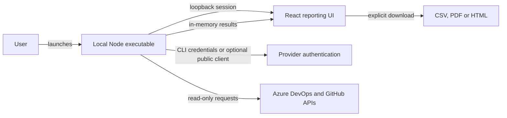

# Committer Insights

Explore Azure DevOps and GitHub repository usage, security enablement, and purchasing evidence on your own computer. The executable opens a local reporting workspace with graphs, time filters, repository detail, security estimates, and optional GitHub billing usage. Export CSV, PDF, or standalone HTML without uploading report data to a hosted service.

> **Independent community project.** This repository is not a Microsoft or
> GitHub product, assessment, endorsement, support offering, or official
> licensing source. Some contributors may be Microsoft employees acting in an
> individual or community capacity. Validate estimates, permissions, licensing
> implications, and generated reports against official sources before using them
> for business decisions. See [DISCLAIMER.md](DISCLAIMER.md).

## Why local

- Azure and GitHub tokens and report data stay on the user's computer.
- No hosted API, database, Azure subscription, PAT, or customer secret is required.
- Existing Azure CLI sign-in avoids a Committer Insights app registration and app-specific consent.
- Closing the executable clears its in-memory session and reports.

## Get started

1. Download the Windows executable and `SHA256SUMS.txt` from the release.
2. Verify the checksum and review its signing status. Unsigned beta artifacts are for evaluation only; a checksum does not verify the publisher. Production distribution requires a verified publisher signature.
3. For Azure DevOps, install Azure CLI once and run `az login`.
4. For GitHub, install GitHub CLI once and run `gh auth login`.
5. Run the executable without Node.js, administrator rights, or installation.
6. Choose Azure DevOps organizations and/or GitHub organizations or enterprises, security plans, and a 7/30/90/180/365-day activity window. Optionally include GitHub organization billing usage using existing account access.
7. Run the minimum-permission check. Inaccessible sources are skipped with a reason and remediation while accessible sources continue.
8. Generate the report, explore usage and coverage, then download CSV, PDF, or standalone HTML output.
9. Close the executable to erase the in-memory session and reports.

### Report exports

- **CSV:** one consistent row-type format for single-provider and combined reports, including metadata, summaries, contribution detail, source status, cost scenarios and warnings. Filter by `rowType` and `countUnit` before summing; summary and contribution rows overlap. UTF-8 text and spreadsheet formula neutralization are preserved.
- **HTML:** complete offline report with section navigation and print styling.
- **PDF:** readable snapshot with provider summaries, costs, source coverage, contributions, Azure estimates and warnings. Unsupported PDF-font characters appear as `?`; use CSV or HTML for full Unicode names.

On-screen filters do not alter downloads: all collected data and evidence are exported. Each format includes repository inventory, individual security-setting states, daily activity, available billing rows and collection evidence. Use CSV for spreadsheet analysis; XLSX is not supported.

The dashboard, HTML and PDF show readable timestamps such as `Sep 24, 2026, 10:00 UTC`. The timezone defaults to UTC and can be set with `COMMITTER_INSIGHTS_TIMEZONE`. Dates without a time remain date-only. CSV and underlying report data retain exact ISO timestamps, including seconds and fractional seconds when supplied. Collection windows, daily activity buckets and billing dates remain UTC regardless of display timezone.

Repository names in the dashboard and HTML export link directly to GitHub or Azure DevOps in a new tab. PDF exports include clickable repository links. Links require a complete repository identifier (including the project for Azure DevOps); incomplete entries remain plain text. Repository access still requires your provider permissions.

### Usage and purchasing review

Each provider opens with an Executive Summary and solution totals, followed by a dedicated **Recommendations** section with a **CIO decision brief**: decision readiness, evidence-linked priorities, suggested owners/timelines and recommended additional collection. Expand a recommendation to inspect its next action and supporting facts. This is deterministic local analysis, **not model-generated AI advice**. It does not infer savings, licensed seats, security severity or compliance from activity/settings. The same analysis is included in CSV, PDF and HTML. Evidence IDs are local to each provider.

Report navigation links to the executive summary, recommendations, usage and security, collection evidence, estimated billing, identity detail and exports. It stays beside the report on desktop and wraps above it on smaller screens. Repository contribution details expand on demand. HTML exports provide section links and keep evidence expanded for offline reading and printing. The overview-to-detail organization is inspired by the [Zero Trust Assessment report](https://microsoft.github.io/zerotrustassessment/demo/); Committer Insights does not run its assessment tests or claim a Zero Trust score.

**AI review brief** provides a copyable aggregate prompt for an approved AI service. No model is connected and nothing is transmitted automatically. It omits repository/source names, identities, raw provider text, URLs and credentials, but aggregate business scale may still be confidential. Review before sharing; generated advice requires human validation. Additional collection priorities are recommendations only: this feature does not add API reads, scopes or permissions.

Switch between **Azure DevOps** and **GitHub Enterprise** report areas. Each has its own Executive Summary, source coverage, repositories, security evidence, activity, estimates and identity detail. The GitHub Enterprise area includes selected GitHub organizations as well as enterprise targets; observed users are not confirmed Enterprise seats. Provider counts and costs are never added together. Switching resets local search and reporting filters. Uncollected providers show an empty state, not zero-cost coverage.

Executive Summary and Estimated Billing include product-specific quantities, monthly USD and annualized USD (monthly x 12). GHAS subtotals combine Code Security and Secret Protection within each provider only when both estimates are available. Enterprise remains a separate scenario. These are planning totals, not invoices or unique-person totals across products. Do not add subtotal rows to their component rows. Every download includes all providers: HTML and PDF have separate provider sections; CSV labels each provider's rows. Uncollected plans remain unpriced, and warnings without provider attribution remain report-wide.

- **Overview:** daily, weekly or monthly activity graphs, current enabled/disabled/unknown security coverage, and collection-window monthly price scenarios. Scenarios are separate products, not an additive invoice total, and do not recalculate when narrowing a display filter.
- **Time controls:** select a shorter period or custom UTC dates within collected history. Days without activity appear as zero only for successfully collected histories. Missing, failed or capped history is unavailable, never zero. The last day and edge weeks/months may be partial. Regenerate with a longer collection window to extend history.
- **Repositories:** search sources, projects and repository names; filter a specific security feature by state; order by activity or name. Review active repositories with disabled controls and enabled repositories with no observed activity. These are review signals, not recommendations to disable protection or guaranteed savings.
- **Billing:** optional GitHub organization enhanced-billing usage with product, SKU, repository, quantity/unit, gross amount, discounts and net USD. Only calendar months overlapping the selected period are requested; returned rows are filtered to that period. Permission failures, unsupported responses and enterprise billing gaps remain explicit. No billing settings are changed and no additional privileges are requested.
- **Evidence:** per-source, per-dataset status and limitations. Partial repository failures preserve other results. Cost scenarios are omitted for providers with incomplete required usage/estimate data or skipped sources.

### Interpret the results

- Azure activity uses default-branch **committer dates**, including automation. GitHub uses default-branch **authored dates**, excluding Dependabot and GitHub Actions bots. Neither is an official security billing meter or complete machine-account inventory.
- Graphs and inventory deduplicate overlapping repository selections; when windows differ, the widest complete history is used. Identity/contribution summaries can repeat activity across overlapping sources. Summary repository counts reflect observed included activity, not the complete inventory.
- Identity totals deduplicate within each provider, never across Azure DevOps and GitHub. Linked GitHub accounts use stable IDs; unlinked name matches are heuristic and require review. Per-repository contributions provide the detail breakdown, not a merged identity's total.
- Azure identity records can repeat across products. Estimates deduplicate within organization and product; preview estimates do not prove current enablement or invoiced licenses. GitHub billing status is **unknown**, not **unlicensed**: observed authors do not establish pushed-commit windows, membership eligibility or billable seats.
- Security settings are current snapshots, not historical coverage or proof of successful scans. Missing settings remain unknown. Failed or capped activity histories remain unavailable, not zero.
- Provider-reported billing and modeled costs are separate. Do not sum quantities with different units or treat reported usage as a settled invoice.

### Pricing assumptions

The application's list-price scenarios use these monthly USD rates, recorded on September 24, 2026. Verify current prices and your agreement before purchasing.

| Product                        |       Monthly unit price | Pricing reference                                                                                       |
| ------------------------------ | -----------------------: | ------------------------------------------------------------------------------------------------------- |
| Azure DevOps Code Security     |        $30 per committer | [Azure DevOps pricing](https://azure.microsoft.com/en-us/pricing/details/devops/azure-devops-services/) |
| Azure DevOps Secret Protection |        $19 per committer | [Azure DevOps pricing](https://azure.microsoft.com/en-us/pricing/details/devops/azure-devops-services/) |
| GitHub Code Security           | $30 per active committer | [GitHub security plans](https://github.com/security/plans)                                              |
| GitHub Secret Protection       | $19 per active committer | [GitHub security plans](https://github.com/security/plans)                                              |
| GitHub Enterprise              | Starting at $21 per user | [GitHub pricing](https://github.com/pricing)                                                            |

GitHub scenarios use observed identities, not verified security-billable usage or Enterprise seat totals. Taxes, discounts, negotiated terms, proration, benefits, compute, storage and AI credits are outside these estimates. See the [GitHub Advanced Security billing rules](https://docs.github.com/en/billing/concepts/product-billing/github-advanced-security).

### Read-only coverage

| Dataset                                 | Collected                                                                                                  | Existing access needed                                                                                                      |
| --------------------------------------- | ---------------------------------------------------------------------------------------------------------- | --------------------------------------------------------------------------------------------------------------------------- |
| Azure repository inventory and activity | Visible Git repositories, project, state, UTC daily counts                                                 | Git read (`vso.code` equivalent); no source files are retained                                                              |
| Azure security enablement               | Code Security, Secret Protection, push protection, CodeQL default setup, dependency scanning default setup | Advanced Security read (`vso.advsec` equivalent)                                                                            |
| Azure security estimates                | Current preview estimates for selected plans                                                               | Advanced Security reporting access                                                                                          |
| GitHub inventory and activity           | Repository visibility/state and default-branch activity                                                    | Metadata and Contents read for intended repositories                                                                        |
| GitHub security settings                | Advanced Security bundle, Code Security, secret scanning, push protection, Dependabot security updates     | Fields may require an existing security-manager, organization-owner or repository-admin role; missing fields remain unknown |
| GitHub billing usage                    | Opt-in organization enhanced-billing usage                                                                 | Existing billing-authorized account; endpoint eligibility depends on the account and billing platform                       |

All upstream operations are reads. Do not grant write/admin access merely to fill report gaps; obtain an authorized export from the security or billing owner when necessary. The application reuses CLI credentials that may already have broader permissions; it does not narrow the token itself.

This is repository usage and security reporting, not a complete invoice or organization audit. Azure invoice charges, Basic/Test Plans seats, Visual Studio benefits, Pipelines/Artifacts usage, enterprise membership/seats, enterprise-paid GitHub billing, alert-level findings, work items and historical configuration changes are not collected. GitHub billing rows can include other metered products, but their presence or absence does not establish subscription entitlement, invoice settlement, or complete enterprise spend. Enabled secret scanning, especially on public repositories, does not prove a paid Secret Protection subscription. Disabled default setup does not rule out custom scanning pipelines.

Endpoint references: [Azure repository API](https://learn.microsoft.com/en-us/rest/api/azure/devops/git/repositories/list?view=azure-devops-rest-7.1), [Azure commits](https://learn.microsoft.com/en-us/rest/api/azure/devops/git/commits/get-commits?view=azure-devops-rest-7.1), [Azure enablement](https://learn.microsoft.com/en-us/rest/api/azure/devops/advancedsecurity/org-enablement/get?view=azure-devops-rest-7.2), [GitHub repository settings](https://docs.github.com/en/rest/repos/repos#get-a-repository), and [GitHub billing usage](https://docs.github.com/en/rest/billing/usage#get-billing-usage-report-for-an-organization).

The application never asks for an Azure DevOps PAT, customer app registration, client secret, or tenant identifier. Azure CLI authentication is limited by the signed-in user's existing Azure DevOps permissions. If the optional publisher fallback is enabled, tenant policy may require administrator approval.

GitHub access reuses the active GitHub CLI account. Committer Insights never returns the GitHub token to the browser, but the CLI token may have broader scopes than this report needs. Use a dedicated least-privilege GitHub CLI account when organizational policy requires tighter isolation.

## Privacy and security

The publisher operates no report-processing backend and receives no product telemetry. Authentication and collection contact Microsoft Entra ID, Azure DevOps and GitHub directly. Provider tokens remain in executable memory and are never returned to the browser. CLI tools manage their own credential storage independently; closing this app does not sign you out of those tools.

Reports contain organization and repository identifiers, project/visibility/state metadata, returned committer identities, activity aggregates, security-setting snapshots, collection timestamps and availability explanations. Opt-in GitHub billing adds product/SKU, quantity/unit and gross/discount/net amounts, not payment credentials or invoice receipts. Azure identity metadata may include user principal names.

Source files, pipeline definitions, work-item contents, customer passwords and application client secrets are not retained. GitHub commit messages, patches, filenames, SHAs and author email addresses may arrive in provider responses but are discarded before report construction. Billing rows outside the requested period are discarded.

Reports remain in memory until the process closes; only explicit downloads persist them. Exports contain personal and commercially sensitive information and remain subject to your endpoint, retention and sharing policies. Review exports and aggregate AI prompts before sharing them with authorized recipients.

### Local security boundary

- The host binds only to an OS-assigned port on `127.0.0.1` and validates the exact `Host` header.
- Every API route requires a random 256-bit per-launch capability. The browser reads it from a launch-URL fragment into memory and removes the fragment from browser history. Mutating requests also require the exact loopback origin; cross-origin access is disabled.
- Provider tokens never enter browser storage. GitHub CLI retrieval runs without a shell, ignores environment-provided GitHub token variables and validates the active account with GitHub.
- Provider requests use validated identifiers and fixed hosts. Inventory, history, settings and billing calls reject redirects, have 20-second timeouts and bounded pagination. Activity uses at most four repository workers per source and a 10,000-commit-per-repository cap; capped histories are reported as unavailable.
- CSV values are neutralized against spreadsheet formula injection. HTML output escapes provider-supplied values.
- Normal production logs must exclude credentials, authorization headers, identities, source names, report contents and capability-bearing URLs. Explicit no-browser test mode exposes the launch URL; treat it as a session credential.

Loopback is not authorization by itself. These controls do not protect against a compromised endpoint, same-user memory inspection or a broadly privileged browser extension. The app makes read-only provider calls but cannot narrow the permissions of an existing CLI credential.

See the [threat model](docs/THREAT_MODEL.md) for risks and mitigations. Report vulnerabilities privately through [SECURITY.md](SECURITY.md), not a public issue.

## Build from source

Prerequisites:

- Node.js 24.19.0
- npm 11.17.0
- Azure CLI with an authenticated user (`az login`) for live report testing
- GitHub CLI with an authenticated user (`gh auth login`) for live GitHub report testing
- Optional multitenant public-client registration for the non-CLI fallback; see [docs/ENTRA_SETUP.md](docs/ENTRA_SETUP.md)
- Authenticode signing service or certificate for public releases

```powershell
npm ci
npm run build:exe
.\release\committer-insights.exe
```

To include the optional fallback, set `COMMITTER_INSIGHTS_CLIENT_ID` before `npm run build:exe`. The client ID is public configuration, not a secret.

## Development

```powershell
npm ci
npm run dev
```

`npm run dev` builds the React application and starts the same local host used by the executable. Run `az login` for Azure DevOps and `gh auth login` for GitHub access.

### Architecture



The local host handles authentication, provider collection and in-memory reports; the browser never handles provider tokens. Collection records per-source and per-dataset failures while retaining accessible results. No report is created if every source fails, and incomplete required evidence suppresses affected cost scenarios. No cloud backend, database or background polling is required.

Canonical schemas live in [packages/contracts/src](packages/contracts/src). `Report.insights` separates repository activity/settings, provider billing and dataset checks from modeled `costEstimates`. Shared calculations and export tables keep provider summaries, CIO briefs and evidence consistent across the dashboard and downloads. Display filters cannot extend retained history or reconstruct past security settings.

| Location                                                       | Responsibility                                                                                                                        |
| -------------------------------------------------------------- | ------------------------------------------------------------------------------------------------------------------------------------- |
| [packages/contracts/src](packages/contracts/src)               | Browser-safe schemas, normalization, source-option types, report formats, error codes, Azure plan labels and shared display grouping. |
| [api/src/adapters](api/src/adapters)                           | Provider HTTP calls, response validation, pagination and retry policy. GitHub adapters share one HTTP client.                         |
| [api/src/auth](api/src/auth)                                   | Local CLI credentials and the optional Azure browser fallback; never imported by the frontend.                                        |
| [api/src/services](api/src/services)                           | Provider collection, identity aggregation, scope descriptions and report summaries.                                                   |
| [api/src/reports](api/src/reports)                             | Source-status construction, combined orchestration, price assumptions and in-memory storage.                                          |
| [api/src/exports](api/src/exports)                             | CSV/PDF/HTML serialization, shared filename generation and CSV sanitization.                                                          |
| [app/src/components](app/src/components)                       | Reusable source selection, plan selection and paginated report tables.                                                                |
| [app/src/services/local-api.ts](app/src/services/local-api.ts) | Local capability headers, JSON requests and invalid-session handling.                                                                 |

Packaging bundles the Node host with esbuild and embeds the Vite UI as Node SEA assets. Full builds clear generated compiler output; executable packaging recreates `build/` and `release/`. These directories are disposable; do not keep source files or reports there.

The default theme is dark. Set `COMMITTER_INSIGHTS_THEME=light` **before building** to produce a light-theme application. This is build-time configuration, not a runtime theme switch.

`COMMITTER_INSIGHTS_TIMEZONE` is a runtime display setting, defaulting to `UTC`. Set it before launching the app; no rebuild is needed. Use an IANA timezone such as `America/Toronto`, `America/Los_Angeles` or `Europe/London`. Daylight-saving offsets are applied for each timestamp. Missing, blank or unsupported values fall back to UTC. Each new report captures the resolved timezone for consistent dashboard, HTML and PDF output; reports without this field use UTC.

Use `--timezone` to override the environment setting for one run. Both `--timezone America/Toronto` and `--timezone=America/Toronto` are supported. Precedence is command-line option, then `COMMITTER_INSIGHTS_TIMEZONE`, then UTC. Invalid or missing command-line values stop startup with an error rather than silently using another timezone. `--help` (or `-h`) lists launch options without starting the app. This changes displayed timestamps only, not UTC collection windows or CSV data.

```powershell
.\release\committer-insights.exe --timezone America/Toronto
.\release\committer-insights.exe --timezone=UTC
.\release\committer-insights.exe --help
```

```powershell
$env:COMMITTER_INSIGHTS_TIMEZONE = 'America/Toronto'
.\release\committer-insights.exe
```

## Validation

```powershell
npm run format:check
npm run lint
npm run typecheck
npm run test
npm run build:exe
npm run test:exe
```

`npm run ci` runs this complete sequence. Build output is written to `release/` with `SHA256SUMS.txt`.

Tests use synthetic identities and mocked providers, covering input validation, provider errors, source selection, report grouping, export content, pagination and local-session security. Live provider permissions, enterprise endpoint availability and official billing still require separate verification. Close running instances before rebuilding the executable; restarting clears existing in-memory reports.

For pull requests, testing conventions and development boundaries, see [CONTRIBUTING.md](CONTRIBUTING.md).

## Release boundary

See [release notes](docs/RELEASE_NOTES.md) for beta changes, compatibility notes and validation scope.

Node SEA injection modifies the executable after copying Node, so the final binary must be Authenticode-signed and timestamped **after** `npm run build:exe`. CI artifacts are intentionally named `unsigned`; they are Azure CLI-only validation artifacts, not public releases. A public release must include:

- Verified Authenticode signature and RFC 3161 timestamp
- `SHA256SUMS.txt`
- SBOM and build provenance
- A production publisher client ID only when the optional fallback is offered

## Troubleshooting

- **Azure CLI sign-in fails:** run `az login`, select an account in the tenant connected to the Azure DevOps organization, and retry.
- **Organization cannot be accessed:** verify the organization URL and that the signed-in user is a member with Advanced Security reporting access.
- **Administrator approval appears:** Azure CLI was unavailable and the publisher fallback was used. Use `az login` to avoid Committer Insights-specific consent, or ask the tenant administrator to approve the fallback.
- **GitHub sign-in fails:** run `gh auth login --hostname github.com`, confirm the intended active account with `gh auth status --active`, and retry.
- **A GitHub repository is missing:** ensure the active GitHub CLI credential can access it and has completed any required organization SAML authorization.
- **Browser did not open:** copy the loopback URL shown by the application only in explicit no-browser/test mode; normal releases open the default browser automatically.

## License

MIT. See [LICENSE](LICENSE). Microsoft, Azure, Azure DevOps, and GitHub names are
used only to identify the products discussed; the license does not grant rights
to third-party trademarks. See [DISCLAIMER.md](DISCLAIMER.md).
