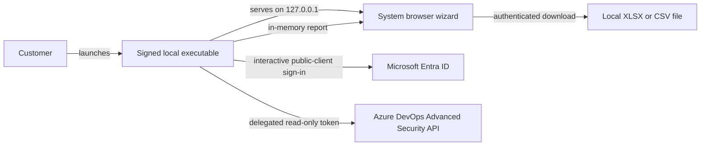
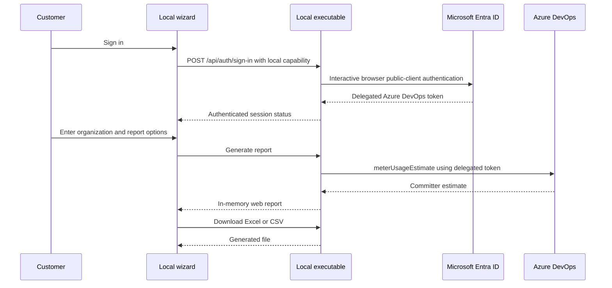

# Architecture

## System context

No application backend, cloud database, Key Vault, Function App, or Static Web App is required.

## Startup sequence

1. The executable generates a 256-bit random capability.
2. It binds an HTTP server to `127.0.0.1` on an OS-assigned port.
3. It opens `http://127.0.0.1:<port>/#session=<capability>`.
4. The React application reads the fragment into module memory and removes it from browser history.
5. API requests send the capability in the `Authorization` header.
6. The local server rejects unexpected Host, Origin, and capability values.

## Authentication sequence

Azure access and refresh tokens are never sent to the React application.

## Packaging

`scripts/build-executable.mjs` bundles the Node host with esbuild, embeds the Vite output as Node SEA assets, injects the SEA blob into a copy of the current Node executable, and writes a SHA-256 manifest. Release automation must sign the completed binary after injection and verify the signature before publication.
