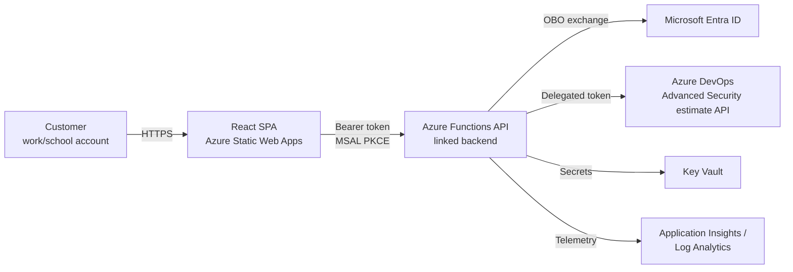
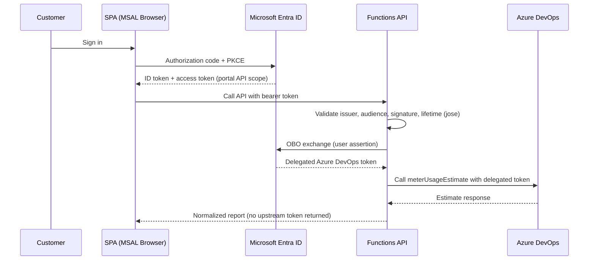
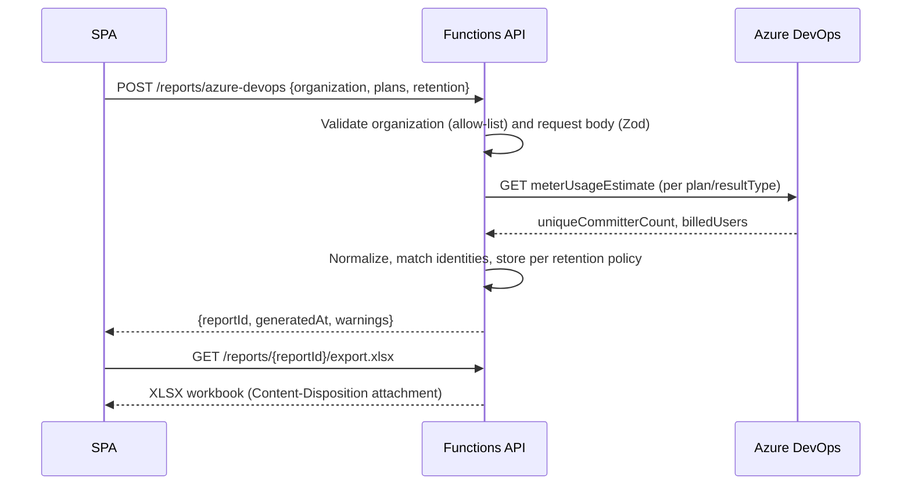
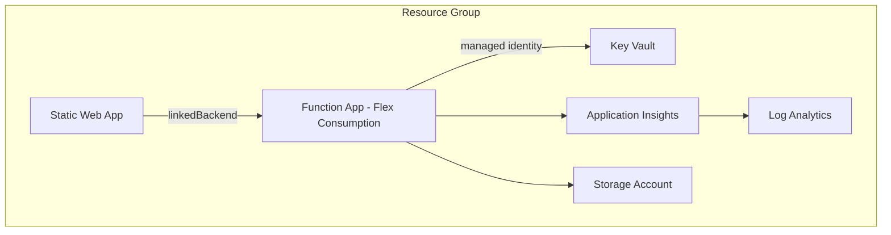
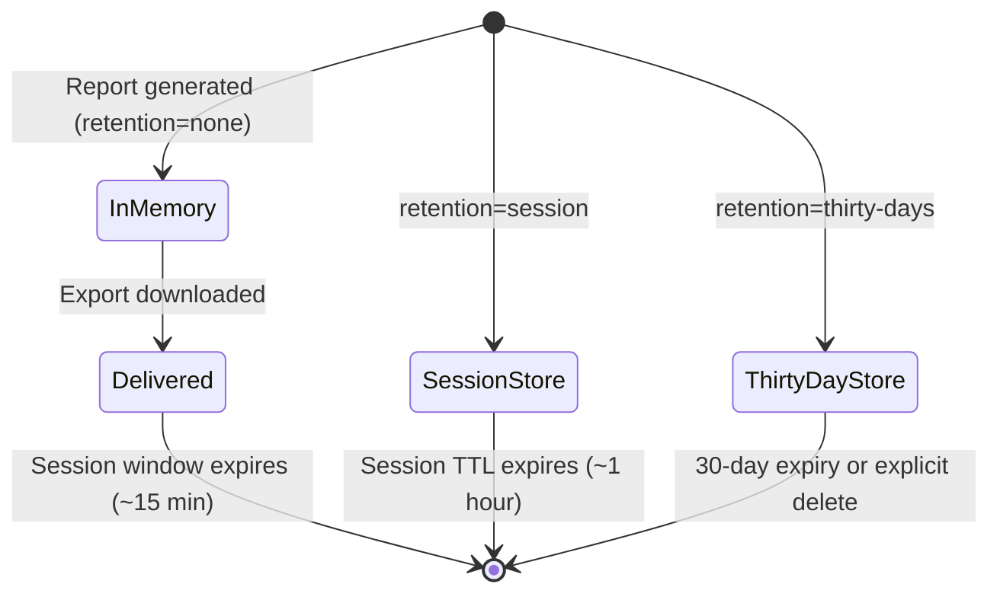

# Architecture

## System context

## Authentication sequence

## Report-generation sequence

## Deployment architecture

## Data retention lifecycle

## Notes

- The frontend is hosted on Azure Static Web Apps; the API is a **linked,
  dedicated** Azure Functions app rather than SWA managed Functions. See
  [adr/0001-linked-function-app.md](adr/0001-linked-function-app.md).
- Static Web Apps built-in authentication is **not** used for sign-in;
  `staticwebapp.config.json` only sets security headers and SPA fallback
  routing. MSAL is the single authoritative sign-in system, avoiding
  duplicate/confusing login experiences.
