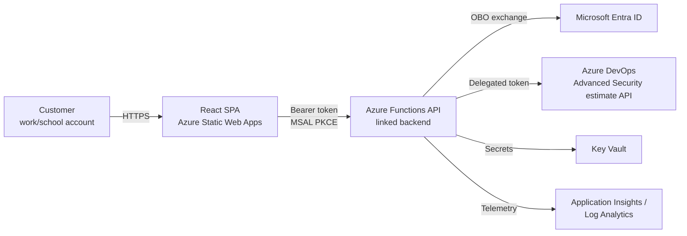
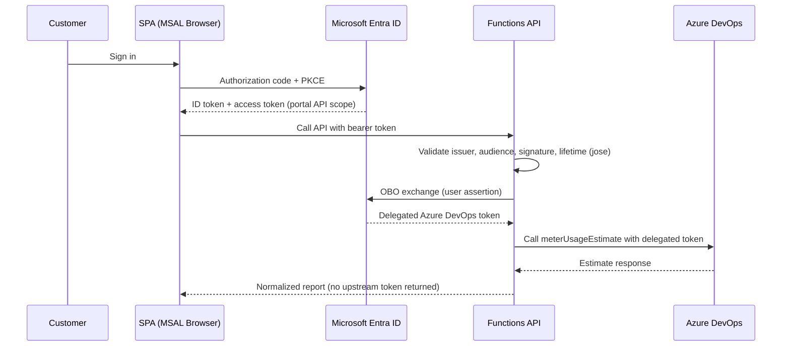
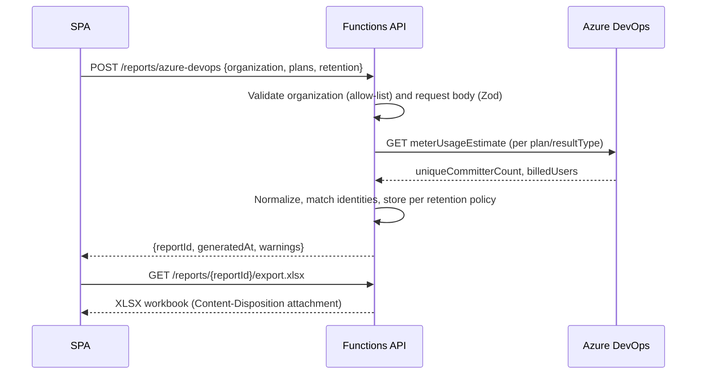
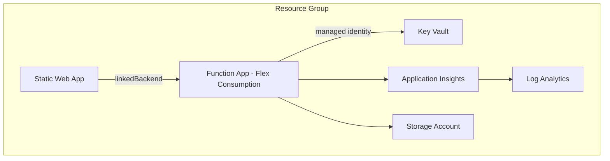
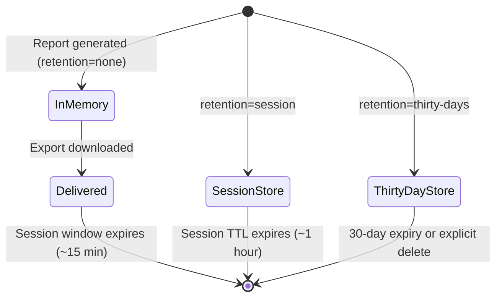

# Architecture

## System context

## Authentication sequence

## Report-generation sequence

## Deployment architecture

### Minimal infrastructure footprint

The frontend is served entirely by the Static Web App with no additional
hosting, CDN, or Front Door tier — Static Web Apps already provides global
edge distribution, TLS, and the SPA fallback this app needs. Only one
additional compute resource exists (the linked Function App), and only
because the OAuth On-Behalf-Of exchange requires a confidential client
credential and outbound calls that the SWA managed-Functions runtime cannot
support (see [adr/0001-linked-function-app.md](adr/0001-linked-function-app.md)).
Every other resource (Key Vault, Log Analytics, Application Insights,
Storage Account) is required by an explicit product or security requirement
— there is no separate networking, Front Door, API Management, or
container-hosting layer.

### Least privilege

- **Azure DevOps access** is delegated OBO on the signed-in user's own
  token; the portal never requests or holds elevated, application-only, or
  tenant-wide Azure DevOps permissions, and Azure DevOps access can never
  exceed what the customer's own account already has (see
  [SECURITY.md](SECURITY.md)).
- **Key Vault**: the API's managed identity is granted only
  `Key Vault Secrets User` (read-only) on its own secrets — never
  `Secrets Officer`/`Contributor`. No other identity has Key Vault access.
- **Storage**: the Function App's own identity needs account-scoped
  `Storage Blob Data Owner`, which is the documented minimum for Flex
  Consumption's identity-based deployment/runtime storage. The separate
  CI/CD publishing identity is granted only `Storage Blob Data Contributor`
  scoped to the single deployment container — not the whole storage
  account, and not the `Owner` role. No Storage Queue/Table role is granted
  to any identity because the app has no queue-triggered or Durable
  Functions.

## Data retention lifecycle

## Notes

- The frontend is hosted on Azure Static Web Apps; the API is a **linked,
  dedicated** Azure Functions app rather than SWA managed Functions. See
  [adr/0001-linked-function-app.md](adr/0001-linked-function-app.md).
- Static Web Apps built-in authentication is **not** used for sign-in;
  `staticwebapp.config.json` only sets security headers and SPA fallback
  routing. MSAL is the single authoritative sign-in system, avoiding
  duplicate/confusing login experiences.
