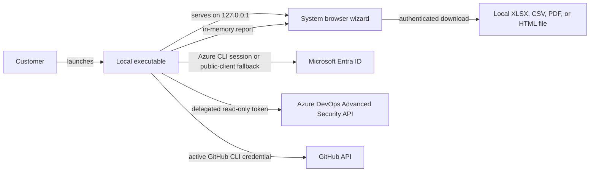
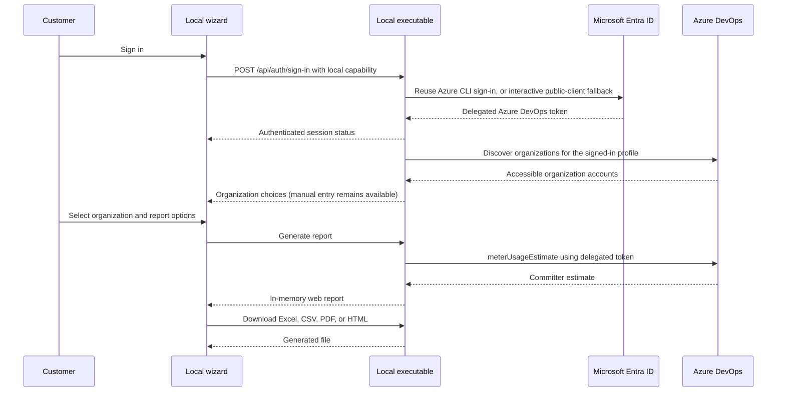
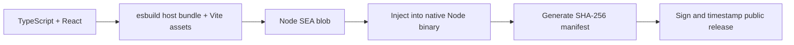

# Architecture

## System context

No application backend, cloud database, Key Vault, Function App, or Static Web App is required.

## Startup sequence

1. The executable generates a 256-bit random capability.
2. It binds an HTTP server to `127.0.0.1` on an OS-assigned port.
3. It opens `http://127.0.0.1:<port>/#session=<capability>`.
4. The React application reads the fragment into module memory and removes it from browser history.
5. API requests send the capability in the `Authorization` header.
6. The local server rejects unexpected Host, Origin, and capability values.

## Authentication sequence

Azure access and refresh tokens are never sent to the React application.

## GitHub collection

The executable invokes `gh auth token --hostname github.com` without a shell and with environment-provided GitHub tokens removed. It validates the account through GitHub's `/user` endpoint, discovers repositories through `/user/repos`, and aggregates commits from the selected repository default branch for a bounded 1–365 day window. Pagination remains fixed to `https://api.github.com` and is capped at 10,000 repositories or commits per operation.

## Combined collection

The combined flow runs the exact provider read operation as a minimum-permission preflight for every selected source. Collection proceeds serially for sources that pass. Failures are recorded as skipped with a reason and remediation; no report is created when every source fails. Executive identity totals deduplicate within Azure DevOps and within GitHub using stable provider IDs, but never merge identities across providers automatically.

## Module Boundaries

- `packages/contracts/src/azure-devops.ts` and `github.ts` own provider schemas and normalization. The package entry point preserves public exports and owns shared report, summary, source-status, and export-format contracts.
- `api/src/adapters/<provider>/` owns upstream HTTP behavior. Provider credentials remain in `api/src/auth/`; `api/src/services/azure-devops.ts` and `github.ts` own collection, identity keys, remediation, and provider report metadata.
- `api/src/reports/` owns combined orchestration, source outcomes, provider-scoped totals, and shared in-memory report creation. `api/src/local-server.ts` retains HTTP routing and the loopback security boundary.
- `api/src/exports/report-export.ts` dispatches formats without depending on HTTP. Each format generator owns its serialization and escaping rules.
- `app/src/services/local-api.ts` owns capability headers and JSON requests. `app/src/providers/` owns provider endpoints, options, and table columns; pages compose the shared `SourcePicker` and `ReportTable` components.
- Provider authentication, upstream response parsing, and identity semantics stay separate. They are not interchangeable implementations of the same protocol.

## Packaging

`scripts/build-executable.mjs` bundles the Node host with esbuild, embeds the Vite output as Node SEA assets, injects the SEA blob into a copy of the current Node executable, and writes a SHA-256 manifest. Release automation must sign the completed binary after injection and verify the signature before publication.

